# XPSS User Guide

## Quick Start

*  Open a new project

*  Click the "QEPANET" icon to start QEPANET

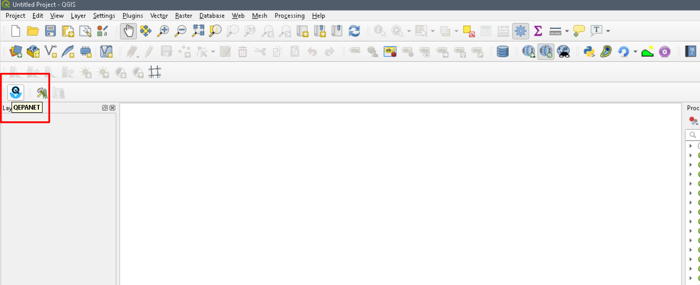

*  Create a new ".inp" file.  This file is a native EPANET input file.  It will contain all the pipe network information that is used by QEPANET.

*  Select a Coordinate System.  Any coordinate system will work, but the most common are 'WGS 64', and 'NAD 83'.  The choice of coordinate system only matters when the project will import existing geographical data with some coordinate system.

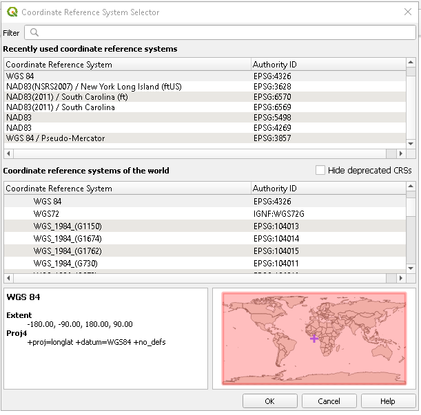

*  The "Options - Hydraulics" dialog box opens.  Ignore these values and Click "OK".  These values are only used for the standard QEPANET solver and are not read by the XPSS scripts.

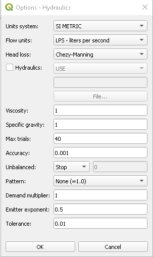

*  Place a "Reservoir" on the canvas using the standard QEPANET tools

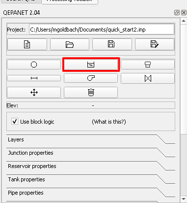

*  Draw all pipes in the system using the QEPANET pipe tool

*  **NOTE:**  It is not necessary to distinguish between pumps and regular nodes.  The XPSS scripts evaluate the system under the assumption that all end nodes are located at a lot and are pump stations.  The system should only consist of 1 reservoir with any number of pipes.  THe pipe layout should not form any loops anywhere within the system

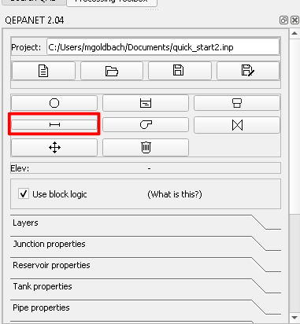

*  An example of a simple pipe network is shown below.

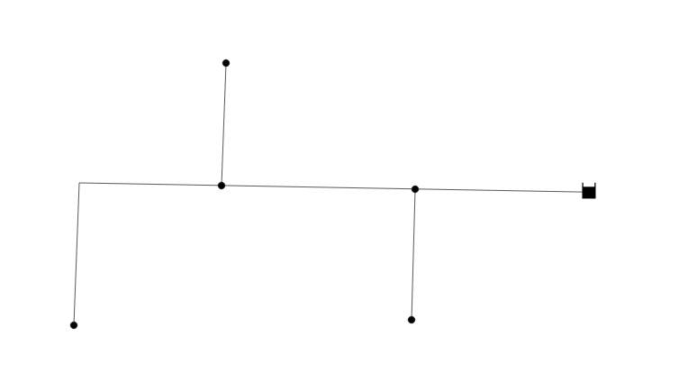

*  From the 'Processing Tool Box' menu select the python script icon, and select 'Open Existing Script...'

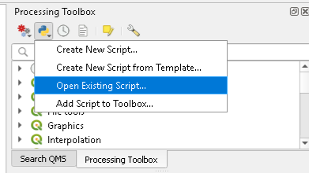

*  Navigate to the XPSS install directory, and open the 'calc_pss_simple_v2.py' file

*  Set the user defined options by editing the variables at the top of the script file

*  Run the script using the 'Run Script' button

*  **NOTE:**  The XPSS install directory is located in the QGIS scripts directory:
`C:\{QGIS Install Dir}\profiles\default\python\qepanet`

*  **NOTE:**  Details on the various user define options can be found [here](user_defined_options.md)

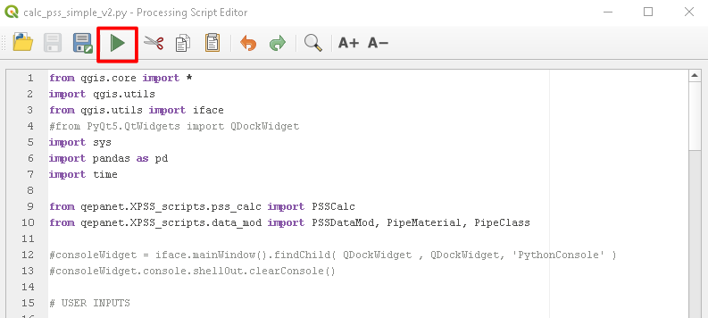

*  If the script is completed without errors, the results of the system are stored in the QGIS attributes, and can be visualized by styling the various QGIS layers

## Visualizing the Results

Once the pipe network calculation has been completed, the results can viewed with predefined QGIS layers for:

*  Pipe Diameters (Which also includes Zone Designation and #EDUs if more than 1 EDU is attached to a node)
*  Pipe Velocity
*  Node Pressures

To load a predefined pipe layer:

*  Right click the Pipe layer under the 'Layers' dialog and select 'Properties'

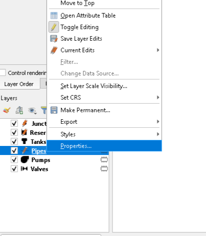

*  Select the `Style` dropdown menu and then `Load Style..`

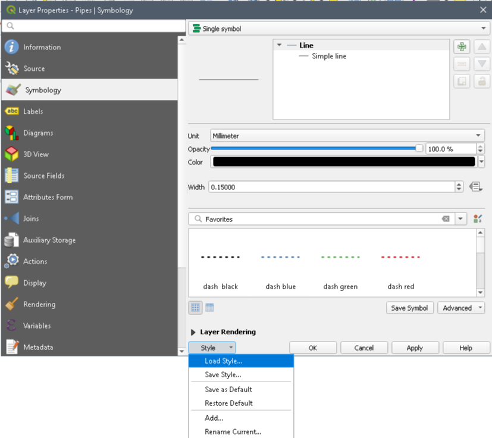

*  Click the `...` button to browse for a new file.  Navigate to the `C:\{XPSS Directory}\qml` directory and select the `pipes_dia_labels.qml` file.

*  Select `Load Style` and then `OK`

*  The pipe layer on the QGIS canvas will now be colored according to the calculiated pipe diameter and color legen will appear under the layer in the `Layers` dialog.

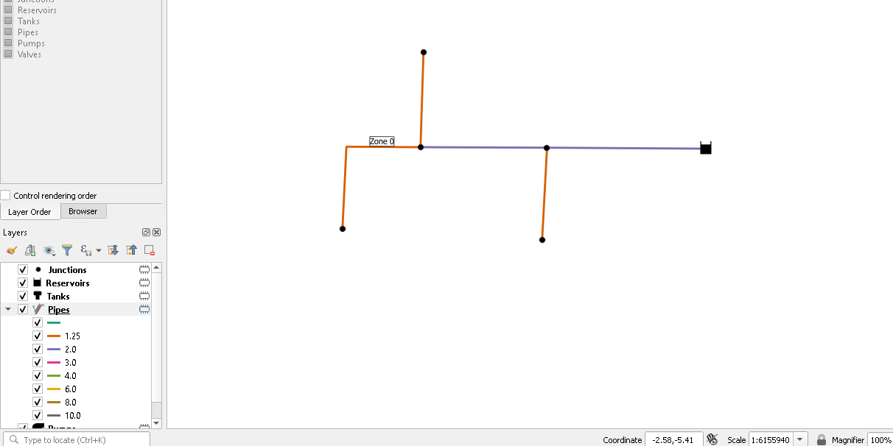

*  The process is the same to color the pipe system by Pipe Velocity and Node Pressures, except that the `.qml` file for each option should be as follows:

  *  Pipe Velocity:  `pipes_vel_labels.qml`
  *  Node Pressures:  `junctions_pres_labels.qml`

In addition, for the Node Pressures, the `Junctions` layer properties should be selected (rather than the `Pipes` layer)

 
## Adding Elevation Data

To automatically extract elevation data as te pipe network is drawn, a raster image of the area elevation must first be loaded.  This is typically done either by uploading an existing raster image or extracting the elevation data from AutoCAD drawings.

### Uploading existing raster data.

*  Existing elevation data can be downloaded from many sources, such as:

[USGS](https://viewer.nationalmap.gov/basic/)

[Earth Explorer](https://earthexplorer.usgs.gov/)

[Open Topography](https://opentopography.org/)

*  Once the tiff image of elevation data has been dowbloaded, load it into QGIS as a raster image:
  *  From the QGIS Menu, select `Layer` > `Add Layer` > `Add Raster Layer`

* Once loaded into the QGIS, the raster layer should appear in the QEPANET panel in the `DEM` dropdown located under the `Layers` section.  Select the suitable elevation layer from this drop down.

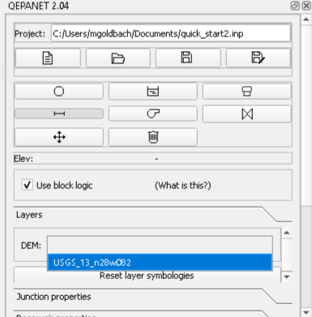

*  After the layer is selected in the dialog any new junction elements will be created with the elevation extractead from this raster image.  The elevation is displayed in the QEPANET panel as the cursor moves over the raster image in the QGIS canvas.

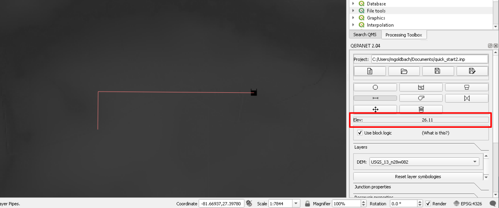

